# Proposal Preparation
## 1. Dataset Descripition
I decided to pick **Olympic Games results from 1896 to 2016** as my dataset since I have a profound interest in sports and would like to explore one of the biggest sporting events across the world.

## 2. Importing and Cleaning the Data
### Creating Tables
```sql
CREATE TABLE noc_regions (
	NOC TEXT PRIMARY KEY,
	region TEXT,
	notes TEXT
);
CREATE TABLE athletes (
	ID SERIAL PRIMARY KEY,
	Name TEXT,
	Sex TEXT,
	Age INT,
	Height REAL,
	Weight REAL,
	Team TEXT,
	NOC TEXT,
	Games TEXT,
	YEAR INT,
	Season TEXT,
	City TEXT,
	Sport TEXT,
	EVENT TEXT,
	Medal TEXT,
	FOREIGN KEY (NOC) REFERENCES noc_regions (NOC)
);
```
### Cleaning Data
```sql
--Adjust the columns name to be lowercase
ALTER TABLE athletes RENAME COLUMN "ID" TO id;
ALTER TABLE athletes RENAME COLUMN "Name" TO name;
ALTER TABLE athletes RENAME COLUMN "Sex" TO sex;
ALTER TABLE athletes RENAME COLUMN "Age" TO age;
ALTER TABLE athletes RENAME COLUMN "Height" TO height;
ALTER TABLE athletes RENAME COLUMN "Weight" TO weight;
ALTER TABLE athletes RENAME COLUMN "Team" TO team;
ALTER TABLE athletes RENAME COLUMN "NOC" TO noc;
ALTER TABLE athletes RENAME COLUMN "Games" TO games;
ALTER TABLE athletes RENAME COLUMN "YEAR" TO year;
ALTER TABLE athletes RENAME COLUMN "Season" TO season;
ALTER TABLE athletes RENAME COLUMN "City" TO city;
ALTER TABLE athletes RENAME COLUMN "Sport" TO sport;
ALTER TABLE athletes RENAME COLUMN "EVENT" TO event;
ALTER TABLE athletes RENAME COLUMN "Medal" TO medal;
ALTER TABLE noc_regions RENAME COLUMN "NOC" TO noc;
```
```sql
--Drop the primary key in ID since one athlete can participate in multiple competitions within the same sporting event
SELECT constraint_name
FROM information_schema.table_constraints
WHERE table_name = 'athletes' AND constraint_type = 'PRIMARY KEY';

ALTER TABLE athletes
DROP CONSTRAINT athletes_pkey;
```
```sql
--Update SIN to SGP in noc_regions following athletes table
UPDATE noc_regions
SET noc = 'SGP'
WHERE noc = 'SIN';
```
### Importing Data
```sql
-- Insert data into tables while treating 'NA' values AS 'NULL'
\copy athletes(id, name, sex, age, height, weight, team, noc, games, year, season, city, sport, event, medal) 
FROM 'C:/Users/Randy V/Downloads/SportsStats/athlete_events.csv' 
DELIMITER ',' 
CSV HEADER 
NULL 'NA';

\copy noc_regions(noc, region, notes) 
FROM 'C:/Users/Randy V/Downloads/SportsStats/noc_regions.csv' 
DELIMITER ',' 
CSV HEADER 
NULL 'NA';
```
## 3. Initial Exploration Data
### Medals by country
```sql
SELECT
	n.region,
	COUNT (*) AS num_medals
FROM athletes AS a
LEFT JOIN noc_regions AS n
	ON a.noc = n.noc
WHERE medal IS NOT NULL	
GROUP BY n.region
ORDER BY num_medals DESC;
```
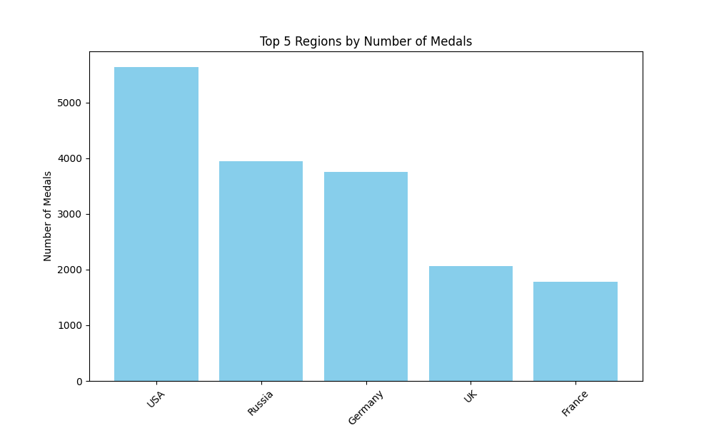
*Bar Chart is limited by 5 due to visualization limitation issues*

### Number of competitions in each sport throughout the whole olympic events
```sql
SELECT
	sport,
	COUNT(DISTINCT event) AS num_competitions
FROM athletes	
GROUP BY sport
ORDER BY num_competitions DESC;
```
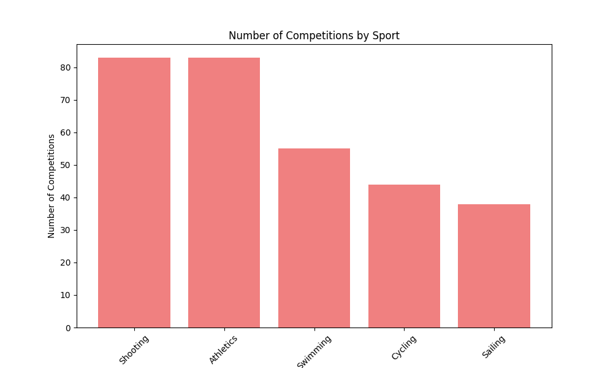
*Bar Chart is limited by 5 due to visualization limitation issues*

### Most competition by sport across olympic years
```sql
WITH rank_num_competitions_year AS (
SELECT
	"year",
	sport,
	COUNT(DISTINCT event) AS num_competitions,
	RANK () OVER(PARTITION BY "year" ORDER BY COUNT(DISTINCT event) DESC) AS rank_sport
FROM athletes
--WHERE "year" BETWEEN 2000 AND 2016
GROUP BY 
	sport,
	"year"
ORDER BY "year", num_competitions DESC
)
SELECT 
	"year",
	sport,
	num_competitions
FROM rank_num_competitions_year
WHERE rank_sport = 1 ;
```
| Year | Sport               | Num Competitions |
|------|---------------------|------------------|
| 1896 | Athletics           | 12               |
| 1900 | Athletics           | 23               |
| 1904 | Athletics           | 24               |
| 1906 | Athletics           | 21               |
| 1908 | Athletics           | 26               |
| 1912 | Athletics           | 30               |
| 1920 | Athletics           | 29               |
| 1924 | Athletics           | 27               |
| 1928 | Athletics           | 27               |
| 1932 | Athletics           | 29               |
| 1936 | Athletics           | 29               |
| 1948 | Athletics           | 33               |
| 1952 | Athletics           | 33               |
| 1956 | Athletics           | 33               |
| 1960 | Athletics           | 34               |
| 1964 | Athletics           | 36               |
| 1968 | Athletics           | 36               |
| 1972 | Athletics           | 38               |
| 1976 | Athletics           | 37               |
| 1980 | Athletics           | 38               |
| 1984 | Athletics           | 41               |
| 1988 | Athletics           | 42               |
| 1992 | Athletics           | 43               |
| 1994 | Cross Country Skiing| 10               |
| 1994 | Alpine Skiing       | 10               |
| 1994 | Speed Skating       | 10               |
| 1996 | Athletics           | 44               |
| 1998 | Alpine Skiing       | 10               |
| 1998 | Cross Country Skiing| 10               |
| 1998 | Speed Skating       | 10               |
| 2000 | Athletics           | 46               |
| 2002 | Cross Country Skiing| 12               |
| 2004 | Athletics           | 46               |
| 2006 | Speed Skating       | 12               |
| 2006 | Cross Country Skiing| 12               |
| 2008 | Athletics           | 47               |
| 2010 | Speed Skating       | 12               |
| 2010 | Cross Country Skiing| 12               |
| 2012 | Athletics           | 47               |
| 2014 | Cross Country Skiing| 12               |
| 2014 | Speed Skating       | 12               |
| 2016 | Athletics           | 47               |

### Age distribution of athletes
```sql
SELECT
	age,
	COUNT(DISTINCT id) AS num_athletes
FROM athletes
GROUP BY age
ORDER BY age ASC
```
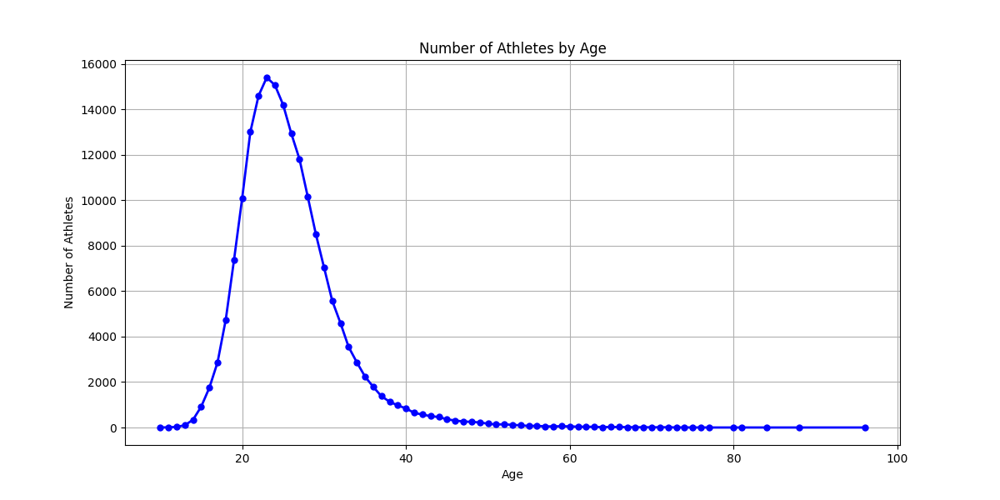

### Weight and Height Distribution of each sport
```sql
SELECT
	sport,
	ROUND(AVG(height),2) AS avg_height,
	ROUND(AVG(weight),2) AS avg_weight
FROM athletes
WHERE 
	height IS NOT NULL AND 
	weight IS NOT NULL
GROUP BY sport
ORDER BY 
	avg_height DESC,
	avg_weight DESC
```
| **Sport**               | **Avg Height (cm)** | **Avg Weight (kg)** |
|-------------------------|---------------------|---------------------|
| Basketball              | 191.21              | 85.78               |
| Volleyball              | 186.98              | 78.90               |
| Beach Volleyball        | 186.20              | 79.09               |
| Water Polo              | 185.03              | 84.57               |
| Rowing                  | 184.26              | 80.17               |
| Handball                | 183.41              | 81.50               |
| Tug-Of-War              | 182.73              | 91.64               |
| Baseball                | 182.60              | 85.72               |
| Bobsleigh               | 181.60              | 89.15               |
| Motorboating            | 181.00              | 77.00               |
| Ice Hockey              | 178.92              | 80.84               |
| Tennis                  | 178.92              | 70.80               |
| Swimming                | 178.59              | 70.59               |
| Canoeing                | 178.55              | 76.49               |
| Sailing                 | 178.26              | 75.97               |
| Modern Pentathlon       | 178.10              | 70.28               |
| Fencing                 | 177.30              | 71.39               |
| Taekwondo               | 176.75              | 68.09               |
| Luge                    | 176.66              | 77.28               |
| Nordic Combined         | 176.52              | 66.91               |
| Ski Jumping             | 176.49              | 65.08               |
| Athletics               | 176.26              | 69.25               |
| Skeleton                | 176.22              | 74.17               |
| Cycling                 | 176.16              | 70.07               |
| Football                | 175.39              | 70.45               |
| Rugby Sevens            | 175.36              | 79.01               |
| Equestrianism           | 174.40              | 67.80               |
| Badminton               | 174.22              | 68.17               |
| Curling                 | 174.17              | 72.13               |
| Judo                    | 174.16              | 78.78               |
| Speed Skating           | 174.10              | 70.03               |
| Golf                    | 174.05              | 71.19               |
| Biathlon                | 174.05              | 66.63               |
| Lacrosse                | 174.00              | 66.50               |
| Rugby                   | 173.67              | 77.53               |
| Triathlon               | 173.64              | 61.82               |
| Shooting                | 173.53              | 74.03               |
| Alpine Skiing           | 173.52              | 72.08               |
| Hockey                  | 173.39              | 69.16               |
| Cross Country Skiing    | 173.26              | 65.88               |
| Archery                 | 173.25              | 70.01               |
| Snowboarding            | 173.04              | 69.53               |
| Art Competitions        | 172.82              | 74.61               |
| Boxing                  | 172.79              | 65.24               |
| Wrestling               | 172.39              | 75.51               |
| Table Tennis            | 171.25              | 64.92               |
| Freestyle Skiing        | 170.94              | 67.03               |
| Short Track Speed Skating| 170.11             | 64.31               |
| Softball                | 169.43              | 67.47               |
| Synchronized Swimming   | 168.49              | 55.86               |
| Figure Skating          | 168.15              | 59.54               |
| Weightlifting           | 167.82              | 79.55               |
| Rhythmic Gymnastics     | 167.80              | 48.76               |
| Diving                  | 166.66              | 60.58               |
| Trampolining            | 166.56              | 59.32               |
| Gymnastics              | 162.88              | 56.91               |

### Gender distribution of athletes of each sport
```sql
SELECT
	sport,
	COUNT(DISTINCT(CASE WHEN sex = 'M' THEN id END)) AS num_males,
	COUNT(DISTINCT(CASE WHEN sex = 'F' THEN id END)) AS num_females
FROM athletes
GROUP BY sport
ORDER BY 
	num_males DESC,
	num_females DESC 
;
```
| **Sport**                | **Num Males** | **Num Females** |
|--------------------------|---------------|-----------------|
| Athletics                | 15542         | 6529            |
| Rowing                   | 6204          | 1483            |
| Football                 | 5427          | 734             |
| Boxing                   | 5197          | 65              |
| Swimming                 | 5144          | 3621            |
| Cycling                  | 5105          | 714             |
| Wrestling                | 4766          | 222             |
| Shooting                 | 4145          | 737             |
| Sailing                  | 3851          | 629             |
| Ice Hockey               | 3386          | 498             |
| Fencing                  | 3243          | 880             |
| Hockey                   | 2829          | 996             |
| Gymnastics               | 2635          | 1499            |
| Weightlifting            | 2526          | 356             |
| Canoeing                 | 2504          | 702             |
| Basketball               | 2481          | 932             |
| Water Polo               | 2262          | 337             |
| Judo                     | 1967          | 757             |
| Equestrianism            | 1886          | 459             |
| Alpine Skiing            | 1739          | 996             |
| Cross Country Skiing     | 1683          | 717             |
| Handball                 | 1675          | 1027            |
| Art Competitions         | 1610          | 204             |
| Bobsleigh                | 1585          | 109             |
| Volleyball               | 1374          | 1129            |
| Speed Skating            | 1054          | 528             |
| Ski Jumping              | 844           | 30              |
| Diving                   | 831           | 635             |
| Biathlon                 | 764           | 371             |
| Baseball                 | 761           | 0               |
| Tennis                   | 760           | 486             |
| Modern Pentathlon        | 750           | 114             |
| Figure Skating           | 748           | 824             |
| Archery                  | 613           | 500             |
| Nordic Combined          | 605           | 0               |
| Luge                     | 544           | 228             |
| Badminton                | 399           | 412             |
| Table Tennis             | 372           | 377             |
| Freestyle Skiing         | 359           | 267             |
| Snowboarding             | 328           | 239             |
| Taekwondo                | 241           | 229             |
| Short Track Speed Skating| 235           | 209             |
| Beach Volleyball         | 194           | 189             |
| Curling                  | 186           | 160             |
| Triathlon                | 180           | 175             |
| Tug-Of-War               | 160           | 0               |
| Rugby                    | 155           | 0               |
| Rugby Sevens             | 151           | 148             |
| Golf                     | 148           | 70              |
| Skeleton                 | 101           | 45              |
| Polo                     | 87            | 0               |
| Lacrosse                 | 60            | 0               |
| Trampolining             | 49            | 44              |
| Alpinism                 | 24            | 1               |
| Cricket                  | 24            | 0               |
| Military Ski Patrol      | 24            | 0               |
| Motorboating             | 13            | 1               |
| Jeu De Paume             | 11            | 0               |
| Croquet                  | 7             | 3               |
| Racquets                 | 7             | 0               |
| Roque                    | 4             | 0               |
| Basque Pelota            | 2             | 0               |
| Aeronautics              | 1             | 0               |
| Rhythmic Gymnastics      | 0             | 567             |
| Synchronized Swimming    | 0             | 550             |
| Softball                 | 0             | 367             |

### Year and season medal distributions
```sql
SELECT
	"year",
	SUM(CASE WHEN season = 'Summer' THEN 1 ELSE 0 END) AS num_summer_games,
	SUM(CASE WHEN season = 'Winter' THEN 1 ELSE 0 END) AS num_winter_games
FROM athletes a 
GROUP BY "year"
ORDER BY "year";
```
| Year | Num Summer Games | Num Winter Games |
|------|------------------|------------------|
| 1896 | 380              | 0                |
| 1900 | 1936             | 0                |
| 1904 | 1301             | 0                |
| 1906 | 1733             | 0                |
| 1908 | 3101             | 0                |
| 1912 | 4040             | 0                |
| 1920 | 4292             | 0                |
| 1924 | 5233             | 460              |
| 1928 | 4992             | 582              |
| 1932 | 2969             | 352              |
| 1936 | 6506             | 895              |
| 1948 | 6405             | 1075             |
| 1952 | 8270             | 1088             |
| 1956 | 5127             | 1307             |
| 1960 | 8119             | 1116             |
| 1964 | 7702             | 1778             |
| 1968 | 8588             | 1891             |
| 1972 | 10304            | 1655             |
| 1976 | 8641             | 1861             |
| 1980 | 7191             | 1746             |
| 1984 | 9454             | 2134             |
| 1988 | 12037            | 2639             |
| 1992 | 12977            | 3436             |
| 1994 | 0                | 3160             |
| 1996 | 13780            | 0                |
| 1998 | 0                | 3605             |
| 2000 | 13821            | 0                |
| 2002 | 0                | 4109             |
| 2004 | 13443            | 0                |
| 2006 | 0                | 4382             |
| 2008 | 13602            | 0                |
| 2010 | 0                | 4402             |
| 2012 | 12920            | 0                |
| 2014 | 0                | 4891             |
| 2016 | 13688            | 0                |


## 4. ERD
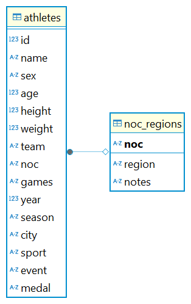
# Project Proposal
## 1. Description
Welcome to my **SQL Portfolio Project**, where I analyze **Olympic Games results from 1896 to 2016**. This project serves as a deep dive into historical trends and insights from the Games, with the goal of **providing valuable data-driven strategies for countries to better plan for future Olympic events**. Through this exploration, I aim to **uncover patterns and trends** that could help inform decision-making and strategic planning for nations looking to improve their performance in upcoming competitions.
## 2. Questions
- What is the correlation between sports with a high number of competitions and a country's success in winning Olympic medals?

	*The goal is to identify sports with many competitions and explore their impact on a country’s medal achievements in the Olympics.*

- How does age influence an athlete's chances of winning medals?

	*The aim is to determine if there is a specific age range where athletes are more likely to win medals.*

- How does Body Mass Index (BMI) — calculated from weight and height — influence an athlete’s chances of winning medals?

	*The focus is on discovering if certain physical attributes, measured through BMI, correlate with higher chances of winning medals.*

## 3. Hypotheses
- Sports that provide **the most competitions** will have a positive impact on overall medal achievements in the Olympics.
- Athletes between **the ages of 26 and 30** tend to win more medals compared to other age groups.
- Athletes with a **BMI in the normal weight range (18.5 - 24.9)** tend to win more medals compared to those in other BMI categories.

## 4. Approach
- The analysis will focus on Olympic data **from 2000 onwards**, as it is more relevant for future planning.
- The study will be centered on the **Summer Olympics**, as it hosts a greater number of events compared to the Winter Olympics.
- **Athletics** will be the primary sport analyzed, as it consistently has the most competitions across Olympic events.
- **Age** will be grouped into categories for easier analysis.
- **BMI** will be used to measure physical attributes (height and weight).

## 5. Descriptive Statistic

### 1. Total medals and participants
```sql
SELECT
	"year",
	COUNT (*) AS total_medals,
	COUNT (DISTINCT id) AS total_participants
FROM athletes
WHERE 
	medal IS NOT NULL AND
	("year" BETWEEN 2000 AND 2016) AND
	sport = 'Athletics' AND
	season = 'Summer'
GROUP BY 
	"year"
ORDER BY
	"year"
; 
```
| Year | Total Medals | Total Participants |
|------|-------------|--------------------|
| 2000 | 190         | 177                |
| 2004 | 180         | 166                |
| 2008 | 187         | 170                |
| 2012 | 190         | 171                |
| 2016 | 192         | 174                |

**Summary:**
- This statistic is used to understand the data in general specifically because there are multiple *id* within the data

**Key Points:**
- The number of total participants is lesser than the total medals meaning that one participant can possibly participate and win medals in multiple sport events in athletics
- The total medals and winners in athletics over 2000 to 2016 slightly change every year.
### 2. Top 10 medals by country in athletics vs overall
#### Top 10 medals in athletics by country
```sql
CREATE VIEW medals_athletics_by_country AS
SELECT
	a."year",
	n.region,
	COUNT(*) AS num_medals
FROM athletes a
LEFT JOIN noc_regions n
	ON a.noc = n.noc
WHERE 
	a.medal IS NOT NULL AND
	(a."year" BETWEEN 2000 AND 2016) AND
	a.sport = 'Athletics' AND
	a.season = 'Summer'
GROUP BY
	a."year",
	n.region
ORDER BY
	a."year",
	num_medals DESC
;

SELECT
	m.region,
	SUM(m.num_medals) AS total_medals,
	ROUND(AVG(m.num_medals)) AS avg_medals,
	PERCENTILE_DISC(0.5) WITHIN GROUP(ORDER BY num_medals) AS median_medals,
	MIN(m.num_medals ) AS min_medals,
	MAX(m.num_medals ) AS max_medals
FROM medals_athletics_by_country AS m
GROUP BY m.region
ORDER BY total_medals DESC
LIMIT 10
```
#### Top 10 medals overall by country

```sql
CREATE VIEW medals_overall_by_country AS
SELECT
	a."year",
	n.region,
	COUNT(*) AS num_medals
FROM athletes a
LEFT JOIN noc_regions n
	ON a.noc = n.noc
WHERE 
	a.medal IS NOT NULL AND
	(a."year" BETWEEN 2000 AND 2016) AND
	a.season = 'Summer'
GROUP BY
	a."year",
	n.region
ORDER BY
	a."year",
	num_medals DESC
;
SELECT
	m.region,
	SUM(m.num_medals) AS total_medals,
	ROUND(AVG(m.num_medals)) AS avg_medals,
	PERCENTILE_DISC(0.5) WITHIN GROUP(ORDER BY num_medals) AS median_medals,
	MIN(m.num_medals ) AS min_medals,
	MAX(m.num_medals ) AS max_medals
FROM medals_overall_by_country AS m
GROUP BY m.region
ORDER BY total_medals DESC
LIMIT 10
;
```
#### Visualization Top 10 medals athletics by country
| Region   | Total Medals | Avg Medals | Median Medals | Min Medals | Max Medals |
|----------|-------------|------------|---------------|------------|------------|
| USA      | 186         | 37         | 38            | 28         | 46         |
| Jamaica  | 105         | 21         | 23            | 13         | 30         |
| Russia   | 93          | 23         | 23            | 18         | 27         |
| Kenya    | 53          | 11         | 11            | 7          | 15         |
| UK       | 41          | 8          | 7             | 6          | 14         |
| Ethiopia | 37          | 7          | 7             | 7          | 8          |
| Bahamas  | 30          | 6          | 6             | 2          | 11         |
| Cuba     | 22          | 4          | 5             | 1          | 9          |
| Nigeria  | 21          | 7          | 7             | 6          | 8          |
| France   | 19          | 5          | 5             | 2          | 6          |


#### Visualization Top 10 medals overall by country
| Region      | Total Medals | Avg Medals | Median Medals | Min Medals | Max Medals |
|------------|-------------|------------|---------------|------------|------------|
| USA        | 1334        | 267        | 263           | 242        | 317        |
| Russia     | 773         | 155        | 142           | 115        | 189        |
| Australia  | 685         | 137        | 149           | 82         | 183        |
| Germany    | 619         | 124        | 118           | 94         | 159        |
| China      | 598         | 120        | 113           | 79         | 184        |
| UK         | 463         | 93         | 81            | 54         | 145        |
| France     | 374         | 75         | 77            | 53         | 96         |
| Italy      | 351         | 70         | 68            | 42         | 104        |
| Japan      | 336         | 67         | 64            | 44         | 93         |
| Netherlands| 333         | 67         | 69            | 47         | 79         |


#### Visualization total medals **athletics** by year and country
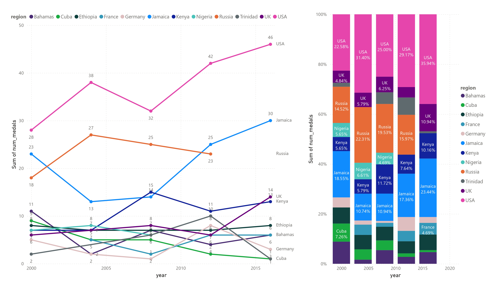

#### Visualization total medals **overall** by year and country
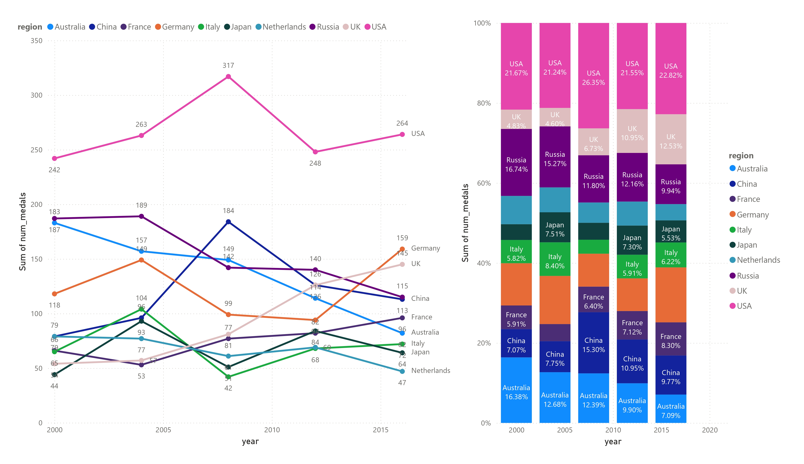

**Summary:**  
The goal of this **descriptive statistic** is to analyze the **correlation** between a country's **performance** in **athletics** and its overall **Olympic** success from **2000 to 2016**.  

**Key Points:**  

- The **USA** consistently dominates in both **athletics** and total **Olympic medals**.  
- Five nations—**USA, Russia, UK, France, and Germany**—rank in the **Top 10** for both **athletics** and overall **Olympic** medal counts.  
- In **2016**, **Russia** was banned from competing in **athletics** due to allegations of a **state-sponsored doping program**.  
- Between **2000 and 2016**, **USA, UK, Jamaica, and Kenya** showed an upward trend in **athletics medals**, while **Russia and Nigeria** experienced the most significant decline.  
- In terms of **overall Olympic performance**, **UK** demonstrated the most notable **growth** over this period.  


### 3. Winners by age range in athletics vs overall sports
####  Winners by age range in athletics
```sql 
CREATE VIEW medals_athletics_by_age_range AS
SELECT
	a."year",
	CASE 
		WHEN age <= 20 THEN '<= 20'
		WHEN age BETWEEN 21 AND 25 THEN '21 - 25'
		WHEN age BETWEEN 26 AND 30 THEN '26 - 30'
		WHEN age BETWEEN 31 AND 35 THEN '31 - 35'
		WHEN age BETWEEN 36 AND 40 THEN '36 - 40'
		ELSE '> 40'
	END AS age_range,
	COUNT(DISTINCT id) AS num_participants
FROM athletes a
LEFT JOIN noc_regions n
	ON a.noc = n.noc
WHERE 
	a.medal IS NOT NULL AND
	(a."year" BETWEEN 2000 AND 2016) AND
	a.sport = 'Athletics' AND
	a.season = 'Summer'
GROUP BY
	a."year",
	age_range
ORDER BY
	a."year",
	num_participants DESC
;
SELECT 
	age_range,
	SUM(num_participants) AS total_participants,
	ROUND(AVG(num_participants)) AS avg_participants,
	PERCENTILE_DISC(0.5) WITHIN GROUP(ORDER BY num_participants) AS median_participants,
	MIN(num_participants ) AS min_participants,
	MAX(num_participants ) AS max_participants
FROM medals_athletics_by_age_range
GROUP BY
	age_range
ORDER BY 
	age_range;

```
####  Winners by age range in overall sports
```sql
CREATE VIEW medals_overall_by_age_range AS
SELECT
	a."year",
	CASE 
		WHEN age <= 20 THEN '<= 20'
		WHEN age BETWEEN 21 AND 25 THEN '21 - 25'
		WHEN age BETWEEN 26 AND 30 THEN '26 - 30'
		WHEN age BETWEEN 31 AND 35 THEN '31 - 35'
		WHEN age BETWEEN 36 AND 40 THEN '36 - 40'
		ELSE '> 40'
	END AS age_range,
	COUNT(DISTINCT id) AS num_participants
FROM athletes a
LEFT JOIN noc_regions n
	ON a.noc = n.noc
WHERE 
	a.medal IS NOT NULL AND
	(a."year" BETWEEN 2000 AND 2016) AND
	a.season = 'Summer'
GROUP BY
	a."year",
	age_range
ORDER BY
	a."year",
	num_participants DESC
;
SELECT 
	age_range,
	SUM(num_participants) AS total_participants,
	ROUND(AVG(num_participants)) AS avg_participants,
	PERCENTILE_DISC(0.5) WITHIN GROUP(ORDER BY num_participants) AS median_participants,
	MIN(num_participants ) AS min_participants,
	MAX(num_participants ) AS max_participants
FROM medals_overall_by_age_range
GROUP BY
	age_range
ORDER BY 
	age_range;
```
####  Visualization Winners by age range in athletics
| Age Range  | Total Participants | Avg Participants | Median Participants | Min Participants | Max Participants |
|------------|-------------------|------------------|----------------------|------------------|------------------|
| <= 20      | 59                | 12               | 12                   | 8                | 15               |
| 21 - 25    | 352               | 70               | 69                   | 63               | 84               |
| 26 - 30    | 323               | 65               | 62                   | 58               | 78               |
| 31 - 35    | 105               | 21               | 24                   | 10               | 29               |
| 36 - 40    | 19                | 4                | 4                    | 1                | 7                |

####  Visualization Winners by age range in overall sports
| Age Range  | Total Participants | Avg Participants | Median Participants | Min Participants | Max Participants |
|------------|-------------------|------------------|----------------------|------------------|------------------|
| <= 20      | 886               | 177              | 176                  | 165              | 195              |
| 21 - 25    | 3,499             | 700              | 687                  | 683              | 743              |
| 26 - 30    | 3,200             | 640              | 633                  | 615              | 660              |
| 31 - 35    | 1,172             | 234              | 230                  | 211              | 259              |
| 36 - 40    | 285               | 57               | 55                   | 50               | 66               |
| > 40       | 133               | 27               | 27                   | 23               | 29               |

#### Visualization Winner by age range and year in **athletics** 
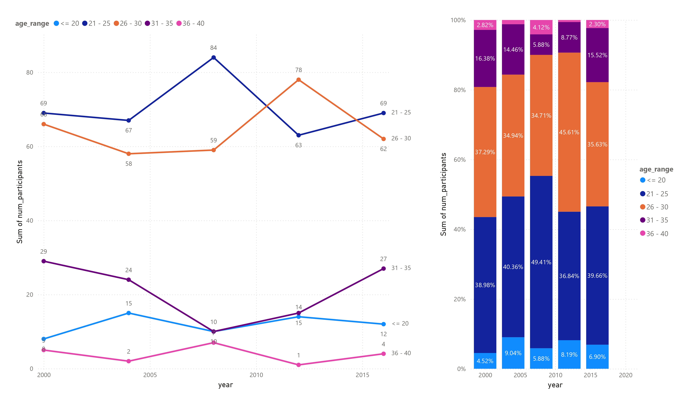

#### Visualization Winner by age range and year in **overall sports** 
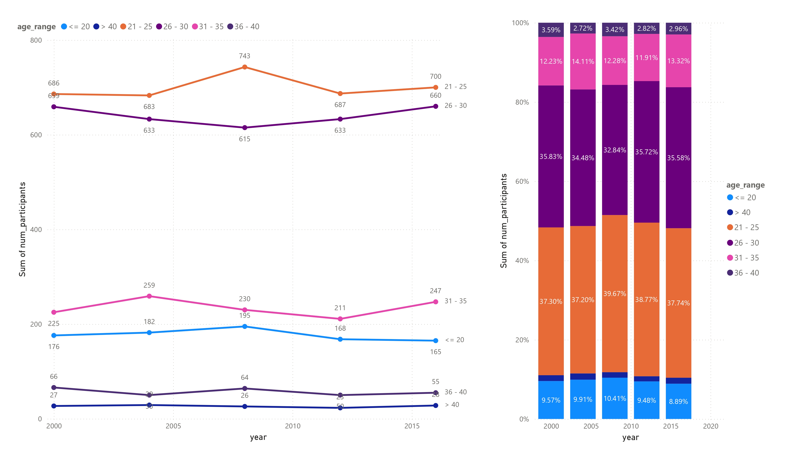

#### Winners Age distribution in **athletics**
```sql
CREATE VIEW medals_athletics_by_age AS
SELECT
	a.age,
	COUNT(DISTINCT id) AS num_participants
FROM athletes a
LEFT JOIN noc_regions n
	ON a.noc = n.noc
WHERE 
	a.medal IS NOT NULL AND
	(a."year" BETWEEN 2000 AND 2016) AND
	a.sport = 'Athletics' AND
	a.season = 'Summer'	
GROUP BY 
	a.age;
```
#### Winners Age distribution in **overall sports**
```sql
CREATE VIEW medals_overall_by_age AS
SELECT
	a.age,
	COUNT(DISTINCT id) AS num_participants
FROM athletes a
LEFT JOIN noc_regions n
	ON a.noc = n.noc
WHERE 
	a.medal IS NOT NULL AND
	(a."year" BETWEEN 2000 AND 2016) AND
	a.season = 'Summer'	
GROUP BY 
	a.age;
	
```
#### Visualization Winners Age distribution in **athletics**
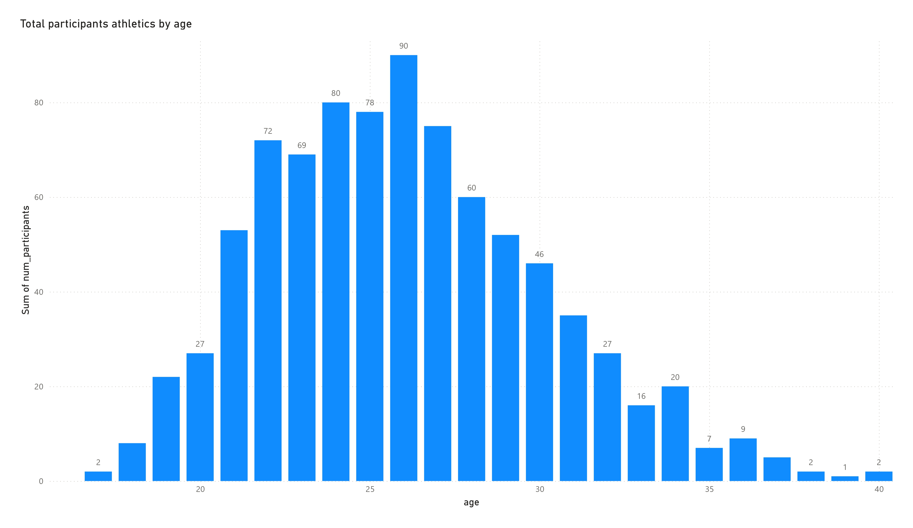
#### Visualization Winners Age distribution in **overall sports**
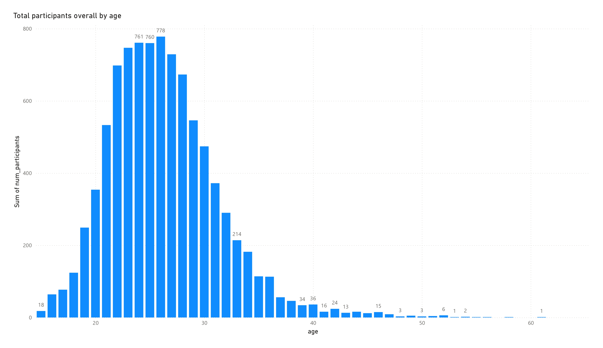
**Summary:**  
This **descriptive statistic** aims to identify the **age ranges** that dominate **Olympic winners** in both **athletics** and overall **sporting events** from **2000 to 2016**.  

**Key Points:**  

- The **21 - 25** age group has won the most **Olympic medals**, with a slight lead over the **26 - 30** age group. Together, these two age ranges account for over **70%** of medal wins in both **athletics** and overall **sporting events**.  
- **Age 26** stands out as the most common age among **Olympic medal winners** in both **athletics** and overall **sporting events**.  

### 4. Winners by BMI range in athletics vs overall
####  Winners by BMI range in **athletics**
```sql
CREATE VIEW medals_athletics_by_bmi_range AS
SELECT
	a."year",
	CASE
		WHEN ROUND(weight/(height/100)^2,2) < 18.5 THEN 'Underweight'
		WHEN ROUND(weight/(height/100)^2,2) BETWEEN 18.5 AND 24.99 THEN 'Normal Weight'
		WHEN ROUND(weight/(height/100)^2,2) BETWEEN 25 AND 29.99 THEN 'Overweight'
		ELSE 'Obesity'
	END AS bmi_range,
	COUNT(DISTINCT id) AS num_participants
FROM athletes a
LEFT JOIN noc_regions n
	ON a.noc = n.noc
WHERE 
	a.medal IS NOT NULL AND
	(a."year" BETWEEN 2000 AND 2016) AND
	a.sport = 'Athletics' AND
	a.season = 'Summer'
GROUP BY
	a."year",
	--bmi,
	bmi_range;

SELECT
	bmi_range,
	SUM(num_participants) AS total_participants,
	ROUND(AVG(num_participants)) AS avg_participants,
	PERCENTILE_DISC(0.5) WITHIN GROUP(ORDER BY num_participants) AS median_participants,
	MIN(num_participants ) AS min_participants,
	MAX(num_participants ) AS max_participants
FROM medals_athletics_by_bmi_range
GROUP BY 
	bmi_range
```
| BMI Range      | Total Participants | Avg Participants | Median Participants | Min Participants | Max Participants |
|---------------|-------------------|------------------|----------------------|------------------|------------------|
| Normal Weight | 621               | 124              | 122                  | 120              | 131              |
| Obesity       | 58                | 12               | 10                   | 8                | 16               |
| Overweight    | 91                | 18               | 18                   | 15               | 22               |
| Underweight   | 88                | 18               | 18                   | 14               | 21               |

####  Winners by BMI range in **overall sports**
```sql
CREATE VIEW medals_overall_by_bmi_range AS
SELECT
	a."year",
	--ROUND(weight/(height/100)^2,2) AS bmi,
	CASE
		WHEN ROUND(weight/(height/100)^2,2) < 18.5 THEN 'Underweight'
		WHEN ROUND(weight/(height/100)^2,2) BETWEEN 18.5 AND 24.99 THEN 'Normal Weight'
		WHEN ROUND(weight/(height/100)^2,2) BETWEEN 25 AND 29.99 THEN 'Overweight'
		ELSE 'Obesity'
	END AS bmi_range,
	COUNT(DISTINCT id) AS num_participants
FROM athletes a
LEFT JOIN noc_regions n
	ON a.noc = n.noc
WHERE 
	a.medal IS NOT NULL AND
	(a."year" BETWEEN 2000 AND 2016) AND
	a.season = 'Summer'
GROUP BY
	a."year",
	--bmi,
	bmi_range;

SELECT
	bmi_range,
	SUM(num_participants) AS total_participants,
	ROUND(AVG(num_participants)) AS avg_participants,
	PERCENTILE_DISC(0.5) WITHIN GROUP(ORDER BY num_participants) AS median_participants,
	MIN(num_participants ) AS min_participants,
	MAX(num_participants ) AS max_participants
FROM medals_overall_by_bmi_range
GROUP BY 
	bmi_range
```
| BMI Range      | Total Participants | Avg Participants | Median Participants | Min Participants | Max Participants |
|---------------|-------------------|------------------|----------------------|------------------|------------------|
| Normal Weight | 6,797             | 1,359            | 1,369                | 1,315            | 1,385            |
| Obesity       | 317               | 63               | 65                   | 49               | 74               |
| Overweight    | 1,696             | 339              | 331                  | 315              | 375              |
| Underweight   | 365               | 73               | 74                   | 66               | 79               |

####  Visualization Winners by BMI range and year in **athletics**
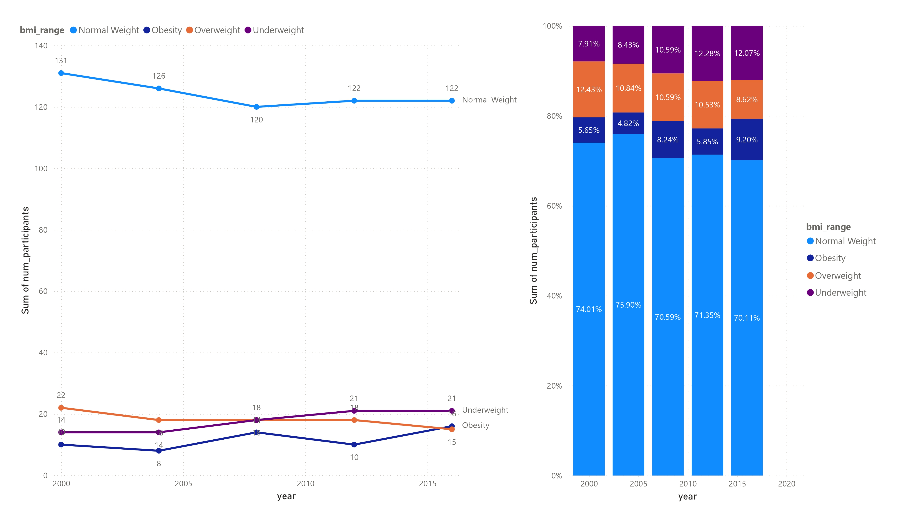
####  Visualization Winners by BMI range and year in **overall sports**
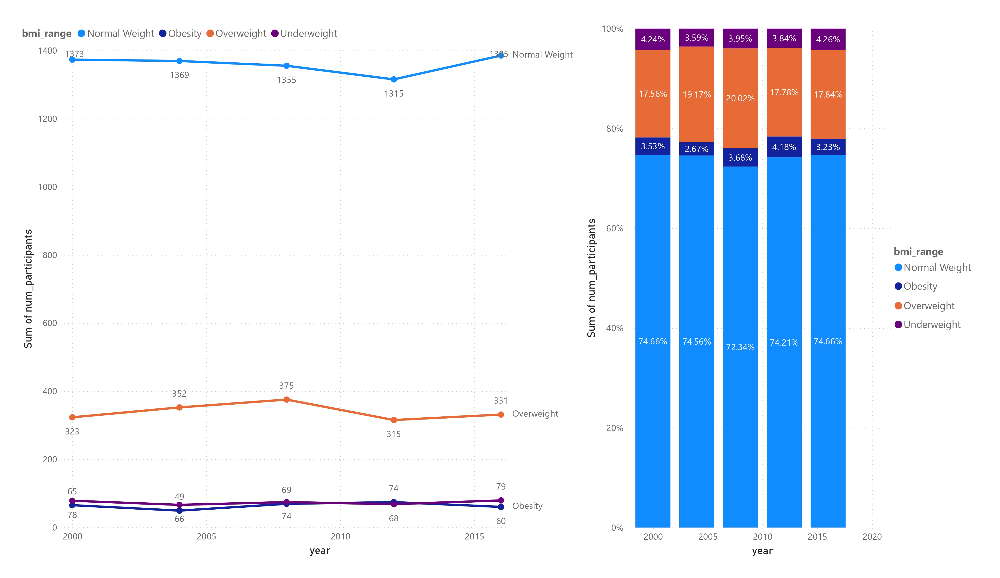
**Summary:**  
This **descriptive statistic** examines which **BMI ranges** dominate among **Olympic winners** in both **athletics** and overall **sporting events** from **2000 to 2016**.  

**Key Points:**  

- **Normal Weight** athletes dominate **Olympic medals** in both **athletics** and overall **sporting events**, with over **70% probability** of winning.  
- Interestingly, in overall **sporting events**, **Overweight** athletes secure **17% to 20% chances of winning medals**, while in **athletics**, the proportion is more evenly distributed between **Overweight** and **Underweight** athletes.  

## 6. Hypotheses Analysis  

### *Initial Hypothesis*  
- Sports that offer **the most competitions** positively impact a country's overall **Olympic medal achievements**.  

### *Result*  
- Analysis suggests that **athletics** does influence medal success, as **5 out of 10 countries** in the **top athletics medal rankings** also appear in the **top 10 overall sporting events medal rankings**. However, this impact is not overwhelmingly strong. Only **the United States and Russia (excluding 2016 data)** show a clear correlation between dominance in **athletics** and overall **sporting events**. While **UK, France, and Germany** rank in the **top 10 for both**, their **athletics** performance is surpassed by **Jamaica and Kenya**, which are not in the **top 10 for overall sporting events**.  

### *Initial Hypothesis*  
- Athletes between **the ages of 26 and 30** are more likely to win medals than those in other age groups.  

### *Result*  
- The **21 - 25** age group wins the most **Olympic medals** in both **athletics** and overall **sporting events**, slightly ahead of the **26 - 30** age group.  

### *Initial Hypothesis*  
- Athletes with a **BMI in the normal weight range (18.5 - 24.9)** are more likely to win medals compared to other BMI categories.  

### *Result*  
- **Normal Weight** athletes overwhelmingly dominate medal wins, accounting for **over 70%** of total victories across all categories.  

### *Additional Questions to Answer*
-  What is the distribution of medal dominance across different sporting events within the top 10 Olympic medalists?
- How does BMI distribution vary across different sporting events? Are certain sports more dominated by Overweight or Underweight athletes?
- Do athletes in the 21 - 25 age range dominate specific sports, or is their success evenly distributed across all sporting events?
- How do the top 10 medal-winning countries compare in terms of age range and BMI trends?
- Are there outliers—athletes who don’t fit the typical age or BMI range—who have still achieved significant success?

## 7. Further Analysis

### 1.Top 10 medals by country in athletics vs overall
#### Method
- Pearson correlation
```sql
CREATE VIEW top_10_medals_athletics_overall AS
SELECT
	n.region,
	SUM(CASE WHEN sport = 'Athletics' THEN 1 ELSE 0 END) AS medals_athletics,
	RANK() OVER (ORDER BY COUNT(*) DESC) AS rank_overall_medals
FROM athletes a
LEFT JOIN noc_regions n
	ON a.noc = n.noc
WHERE 
	a.medal IS NOT NULL AND
	(a."year" BETWEEN 2000 AND 2016) AND
	a.season = 'Summer'
GROUP BY
	n.region
ORDER BY
	medals_athletics DESC
LIMIT 10
;
```
| Region  | Medals Athletics | Rank Overall Medals |
|---------|-----------------|---------------------|
| USA     | 186             | 1                   |
| Jamaica | 105             | 23                  |
| Russia  | 93              | 2                   |
| Kenya   | 53              | 33                  |
| UK      | 41              | 6                   |
| Ethiopia| 37              | 41                  |
| Bahamas | 30              | 46                  |
| Cuba    | 22              | 15                  |
| Nigeria | 21              | 32                  |
| France  | 19              | 7                   |

``` sql
SELECT 
	corr(medals_athletics,rank_overall_medals)
FROM top_10_medals_athletics_overall
```
| Name                     | Correlation Coefficient |
|--------------------------|------------------------|
| Top 10 Medals Athletics | -0.4615                 |

**Summary**
- The **negative value of Correlation Coefficient** indicates an inverse relationship, meaning that as one variable increases, the other tends to decrease. For this case, the increase in number of medals athletics will result in higher ranking of overall olympic medals.
- A correlation of **-0.4615** is **moderate**, suggesting that while there is some relationship, it is not a strong or perfect one.


- Scatter Plot
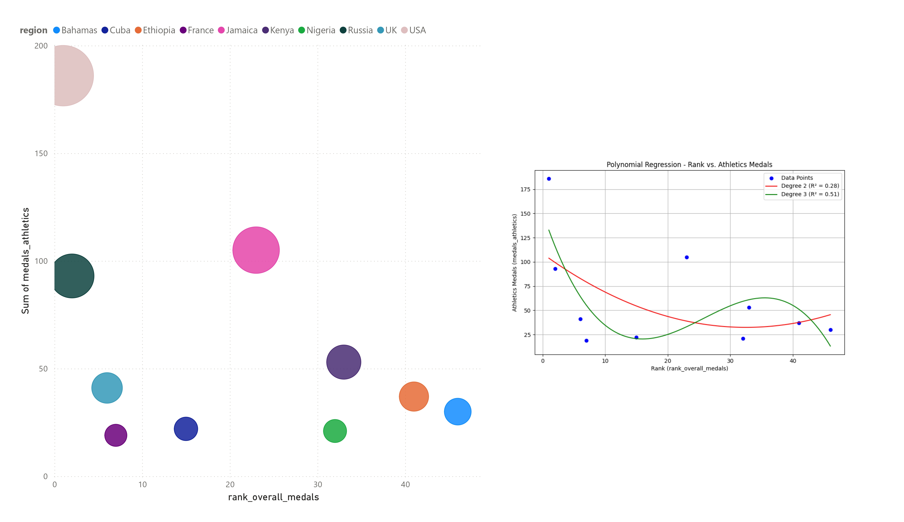

**Summary**
- Non-linear Relationship: Since the R² values for both the quadratic and cubic models are relatively low, it indicates that the relationship between rank_overall_medals and medals_athletics isn't strongly predictive using polynomial regression. The graph showing no clear trend supports this. 
- Hence, it is not strong enough to make precise predictions about rank based only on athletics medals as shown by the scatter plot and the polynomial regression.

### 2. Winners by age range in athletics vs overall sports
#### Pearson Correlation

**A.Age range in athletics and overall sporting events** 

```sql
CREATE VIEW age_medal_corr_athletics AS
SELECT
	age_range,
	CASE
		WHEN age_range = '<= 20' THEN 1
		WHEN age_range = '21 - 25' THEN 2
		WHEN age_range = '26 - 30' THEN 3
		WHEN age_range = '31 - 35' THEN 4
		ELSE 5
	END AS age_group,
	SUM(num_participants) AS num_medals
FROM medals_athletics_by_age_range
GROUP BY age_group,age_range
;
```

| Age Range  | Age Group | Number of Medals |
|------------|----------|------------------|
| ≤ 20       | 1        | 59               |
| 21 - 25    | 2        | 352              |
| 26 - 30    | 3        | 323              |
| 31 - 35    | 4        | 105              |
| 36 - 40    | 5        | 19               |


```sql
CREATE VIEW age_medal_corr_overall AS
SELECT
	age_range,
	CASE
		WHEN age_range = '<= 20' THEN 1
		WHEN age_range = '21 - 25' THEN 2
		WHEN age_range = '26 - 30' THEN 3
		WHEN age_range = '31 - 35' THEN 4
		WHEN age_range = '36 - 40' THEN 5
		ELSE 6
	END AS age_group,
	SUM(num_participants) AS num_medals
FROM medals_overall_by_age_range
GROUP BY age_group,age_range
ORDER BY age_group
;
```
| Age Range  | Age Group | Number of Medals |
|------------|----------|------------------|
| ≤ 20       | 1        | 886              |
| 21 - 25    | 2        | 3,499            |
| 26 - 30    | 3        | 3,200            |
| 31 - 35    | 4        | 1,172            |
| 36 - 40    | 5        | 285              |
| > 40       | 6        | 133              |

```sql
SELECT 
	'Athletics' AS sport,
	corr(age_group,num_medals) AS correlation_coefficient
FROM age_medal_corr_athletics
UNION ALL
SELECT 
	'overall sporting events' AS sport,
	corr(age_group,num_medals) AS correlation_coefficient
FROM age_medal_corr_overall

```

| Sport                  | Correlation Coefficient |
|------------------------|------------------------|
| Athletics             | -0.3340                 |
| Overall Sporting Events | -0.5637                 |

**Summary**
- The **negative value of Correlation Coefficient** for both **Athletics** and **Overall Sporting Events** indicates an inverse relationship, meaning that as one variable increases, the other tends to decrease. For this case, the higher ages of athletes will result in lesser medals that athletes can win.
- A correlation of **-0.3340** for **Athletics** is **moderate**, suggesting that while there is some relationship, it is not a strong or perfect one.
- Meanwhile A correlation of **-0.5637** for **Overall Sporting Events** is **moderately strong** to suggest a meaningful relationship, however it is not a perfect relationship, so other factors might also play a role.

**B. Age range in each sporting events**
```sql
CREATE VIEW age_medal_corr_each AS
SELECT
	sport,
	age_range,
	CASE
		WHEN age_range = '<= 20' THEN 1
		WHEN age_range = '21 - 25' THEN 2
		WHEN age_range = '26 - 30' THEN 3
		WHEN age_range = '31 - 35' THEN 4
		WHEN age_range = '36 - 40' THEN 5
		ELSE 6
	END AS age_group,
	SUM(num_participants) AS num_medals
FROM (
	SELECT
		a."year",
		a.sport,
		CASE 
			WHEN age <= 20 THEN '<= 20'
			WHEN age BETWEEN 21 AND 25 THEN '21 - 25'
			WHEN age BETWEEN 26 AND 30 THEN '26 - 30'
			WHEN age BETWEEN 31 AND 35 THEN '31 - 35'
			WHEN age BETWEEN 36 AND 40 THEN '36 - 40'
			ELSE '> 40'
		END AS age_range,
		COUNT(DISTINCT id) AS num_participants
	FROM athletes a
	LEFT JOIN noc_regions n
		ON a.noc = n.noc
	WHERE 
		a.medal IS NOT NULL AND
		(a."year" BETWEEN 2000 AND 2016) AND
		a.season = 'Summer'
	GROUP BY
		a."year",
		a.sport,
		age_range
	ORDER BY
		a."year",
		a.sport,
		num_participants DESC
)
GROUP BY sport,age_group,age_range
ORDER BY sport,age_group
;
SELECT 
	sport,
	corr(age_group,num_medals) AS correlation_coefficient
FROM age_medal_corr_each
GROUP BY sport
ORDER BY correlation_coefficient
;
```
| Sport                | Correlation Coefficient |
|----------------------|------------------------|
| Rhythmic Gymnastics  | -1.0                   |
| Gymnastics           | -0.9921                |
| Swimming             | -0.7949                |
| Diving               | -0.7807                |
| Archery              | -0.6872                |
| Football             | -0.5805                |
| Cycling              | -0.5098                |
| Taekwondo            | -0.4894                |
| Fencing              | -0.4577                |
| Trampolining         | -0.4438                |
| Canoeing             | -0.4340                |
| Softball             | -0.4141                |
| Modern Pentathlon    | -0.3974                |
| Weightlifting        | -0.3374                |
| Athletics            | -0.3340                |
| Wrestling            | -0.3317                |
| Rowing               | -0.3181                |
| Boxing               | -0.2926                |
| Synchronized Swimming| -0.2848                |
| Handball             | -0.2840                |
| Water Polo           | -0.2726                |
| Hockey               | -0.2614                |
| Baseball             | -0.2088                |
| Sailing              | -0.1466                |
| Volleyball           | -0.1446                |
| Basketball           | -0.1309                |
| Tennis               | -0.1098                |
| Rugby Sevens         | -0.0592                |
| Shooting             | 0.0183                 |
| Judo                 | 0.0340                 |
| Badminton            | 0.0884                 |
| Triathlon            | 0.1147                 |
| Table Tennis         | 0.1449                 |
| Beach Volleyball     | 0.2219                 |
| Equestrianism        | 0.8953                 |
| Golf                 | 1.0                    |

**Summary**
- Sports with **negative correlations:** Most sports in the dataset, like **Gymnastics and Swimming**, show a negative relationship, meaning as the age increases, the number of medals decreases.
- Sports with **positive correlations:** **Equestrianism and Golf** stand out as exceptions with a positive relationship, where an increase of age of athletes is likely to correlate with an increase in the number of medals.

#### Scatter Plot and Regression Model
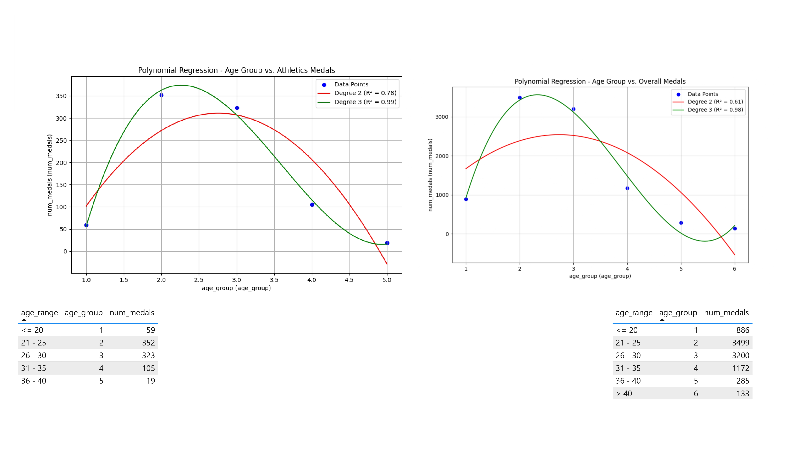

**Summary**
- The degree 3 curve is picked to describe the trend between age group and number of medals compared to degree 2 as the R values is stronger and nearly perfect.
- The polynomial curve likely shows an increase in medal counts from **age ≤ 20 to 25-30**, followed by a decline after 30.
- While the model fits the data well, **it is not ideal for future predictions beyond this dataset**, as polynomial regressions can overfit small datasets.
- The strong R-value in degree 3 suggests this relationship is well-explained by the regression model, but the practical implication remains: **most medalists are in their mid-20s to early 30s.**

### 3. Winners by BMI range in athletics vs overall

#### Pearson Correlation

**A.Age range in athletics and overall sporting events** 
```sql
CREATE VIEW bmi_medal_corr_athletics AS
SELECT 
	bmi_range,
	CASE
		WHEN bmi_range = 'Underweight' THEN 1
		WHEN bmi_range = 'Normal Weight' THEN 2
		WHEN bmi_range = 'Overweight' THEN 3
		WHEN bmi_range = 'Obesity' THEN 4
	END AS bmi_group,
	SUM(num_participants) AS num_medals
FROM medals_athletics_by_bmi_range
GROUP BY bmi_range
ORDER BY bmi_group
;
```

| BMI Range     | BMI Group | Number of Medals |
|--------------|-----------|------------------|
| Underweight  | 1         | 88               |
| Normal Weight | 2        | 621              |
| Overweight   | 3         | 91               |
| Obesity      | 4         | 58               |

```sql
CREATE VIEW bmi_medal_corr_overall AS
SELECT 
	bmi_range,
	CASE
		WHEN bmi_range = 'Underweight' THEN 1
		WHEN bmi_range = 'Normal Weight' THEN 2
		WHEN bmi_range = 'Overweight' THEN 3
		WHEN bmi_range = 'Obesity' THEN 4
	END AS bmi_group,
	SUM(num_participants) AS num_medals
FROM medals_overall_by_bmi_range
GROUP BY bmi_range
ORDER BY bmi_group
;
```

| BMI Range      | BMI Group | Number of Medals |
|---------------|-----------|------------------|
| Underweight   | 1         | 365              |
| Normal Weight | 2         | 6797             |
| Overweight    | 3         | 1696             |
| Obesity       | 4         | 317              |

```sql
SELECT 
	'Athletics' AS sport,
	corr(bmi_group,num_medals) AS correlation_coefficient
FROM bmi_medal_corr_athletics
UNION ALL
SELECT 
	'overall sporting events' AS sport,
	corr(bmi_group,num_medals) AS correlation_coefficient
FROM bmi_medal_corr_overall

```
| Sport                 | Correlation Coefficient  |
|-----------------------|------------------------|
| Athletics            | -0.2949                 |
| Overall Sporting Events | -0.2206                 |

**Summary**
- The **negative value of Correlation Coefficient** for both **Athletics** and **Overall Sporting Events** indicates an inverse relationship, meaning that as one variable increases, the other tends to decrease. For this case, the higher bmi of athletes will result in lesser medals that athletes can win.
- A correlation of both **Athletics and Overall Sporting Events** is below **0.3** and considered **weak** suggesting that there is not a strong linear relationship.
- These results suggest that BMI does not strongly determine the number of medals won in **Athletics or Overall Sporting Events.**

**B. BMI range in each sporting events**

```sql
CREATE VIEW bmi_medal_corr_each AS
SELECT
	sport,
	bmi_range,
	CASE
		WHEN bmi_range = 'Underweight' THEN 1
		WHEN bmi_range = 'Normal Weight' THEN 2
		WHEN bmi_range = 'Overweight' THEN 3
		WHEN bmi_range = 'Obesity' THEN 4
	END AS bmi_group,
	SUM(num_participants) AS num_medals
FROM (SELECT
	a.sport,
	a."year",
	--ROUND(weight/(height/100)^2,2) AS bmi,
	CASE
		WHEN ROUND(weight/(height/100)^2,2) < 18.5 THEN 'Underweight'
		WHEN ROUND(weight/(height/100)^2,2) BETWEEN 18.5 AND 24.99 THEN 'Normal Weight'
		WHEN ROUND(weight/(height/100)^2,2) BETWEEN 25 AND 29.99 THEN 'Overweight'
		ELSE 'Obesity'
	END AS bmi_range,
	COUNT(DISTINCT id) AS num_participants
FROM athletes a
LEFT JOIN noc_regions n
	ON a.noc = n.noc
WHERE 
	a.medal IS NOT NULL AND
	(a."year" BETWEEN 2000 AND 2016) AND
	a.season = 'Summer'
GROUP BY
	a."year",
	a.sport,
	bmi_range
)
--WHERE sport IN ('Modern Pentathlon','Triathlon','Tennis')
GROUP BY
	sport,
	bmi_range,
	bmi_group
ORDER BY
	sport,
	bmi_group
;

SELECT
	sport,
	corr(bmi_group,num_medals) AS correlation_coefficient -- 'Modern Pentathlon and Triathlon IS NULL because they both only contain one bmi_group
FROM bmi_medal_corr_each
GROUP BY sport
ORDER BY correlation_coefficient
;
```
| Sport                    | Correlation Coefficient  |
|--------------------------|------------------------|
| Canoeing                 | -1.0000                |
| Table Tennis             | -1.0000                |
| Beach Volleyball         | -1.0000                |
| Handball                 | -0.9993                |
| Wrestling                | -0.9943                |
| Judo                     | -0.9759                |
| Water Polo               | -0.9753                |
| Weightlifting            | -0.9737                |
| Archery                  | -0.9702                |
| Softball                 | -0.9478                |
| Trampolining             | -0.8998                |
| Badminton                | -0.8739                |
| Rhythmic Gymnastics      | -0.7842                |
| Rugby Sevens             | -0.6133                |
| Baseball                 | -0.5137                |
| Golf                     | -0.5000                |
| Gymnastics               | -0.4749                |
| Boxing                   | -0.3396                |
| Synchronized Swimming    | -0.3267                |
| Athletics                | -0.2949                |
| Equestrianism            | -0.2619                |
| Swimming                 | -0.2575                |
| Fencing                  | -0.2553                |
| Football                 | -0.2445                |
| Cycling                  | -0.2101                |
| Basketball               | -0.1951                |
| Sailing                  | -0.1872                |
| Diving                   | -0.1014                |
| Taekwondo                | -0.1003                |
| Shooting                 | -0.0090                |
| Tennis                   |  0.0000                |
| Volleyball               |  0.0687                |
| Hockey                   |  0.0974                |
| Rowing                   |  0.3016                |
| Modern Pentathlon        | NULL                   |
| Triathlon                | NULL                   |

**Summary:**
- Most sports in the dataset have a negative correlation between BMI and the number of medals won, with a few exceptions.
- **Canoeing, Table Tennis, and Beach Volleyball** show the **most extreme negative correlations**, indicating that lower BMI leads to a higher chance to win more medals.
- **The positive correlations (such as Tennis, Volleyball, Hockey and Rowing)** show **weak relationship**.
- **Modern Pentathlon and Triathlon** returns **NULL** because both categories only have **Normal Weight** winners across the data.

#### Scatter Plot and Regression Model
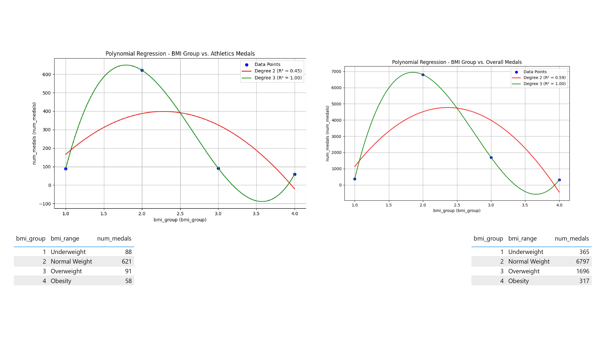

*Summary*
- The degree 3 curve is picked to describe the trend between **bmi group and number of medals** compared to degree 2 as the R values is stronger and perfect.
- The polynomial curve likely shows an increase in medal counts from **Underweight to Normal Weight**, followed by a decline after the latter mention.
- While the model fits the data well, **it is not ideal for future predictions beyond this dataset**, as polynomial regressions can overfit small datasets.
- The strong R-value in degree 3 suggests this relationship is well-explained by the regression model, but the practical implication remains: **most medalists are in Normal Weight.**

## 8. Go Broader
### Key Discoveries
- Based on **Pearse Correlation**, the correlation between winning medals in athletic and overall ranking in Olympic Events is not strong as there are plenty of factors behind getting better overall ranking in Olympic Events.
- The majority of relationship between age group and number of medals displays **negative non-linear relationship** or **polynomial curve** showing that there is an increase of medals from **age ≤ 20 to 25-30**, followed by a decline after 30. However there are several sporting events that show **linear relationship** such as **Rhythmic Gymnastics, Gymnastics, Equestrianism  and Golf**. The first two mentioned show **a negative linear relationship** (younger athletes tend to win more medals) and the latter display **a positive linear relationship** (older athletes tend to win more medals).
-  The majority of relationship between bmi group and number of medals displays **negative non-linear relationship** or **polynomial curve** showing that there is an increase of medals from **Underweight to Normal Weight**, followed by a decline after the latter mention. However there are several sporting events that show **strong linear relationship** such as **Canoeing, Table Tennis, and Beach Volleyball**. All of them show **a negative linear relationship** (lower BMI tend to win more medals).

### Further Descriptive Stats

#### Top 10 Countries by Overall Medals

```sql
SELECT
	n.region,
	COUNT(*) AS num_medals
FROM athletes a
LEFT JOIN noc_regions n
	ON a.noc = n.noc
WHERE 
	a.medal IS NOT NULL AND
	(a."year" BETWEEN 2000 AND 2016) AND
	a.season = 'Summer'
GROUP BY
	n.region
ORDER BY
	COUNT(*) DESC
LIMIT 10
;
```
| Region      | Num Medals |
|------------|------------|
| USA        | 1334       |
| Russia     | 773        |
| Australia  | 685        |
| Germany    | 619        |
| China      | 598        |
| UK         | 463        |
| France     | 374        |
| Italy      | 351        |
| Japan      | 336        |
| Netherlands| 333        |

**Purpose:**
- To analyze and compare the performance of the top 10 countries in the Olympic Games by their total medal count.

**Summary:**
- The **United States** leads with nearly double the number of medals of **Russia**, which holds second place. 
- **Australia**, **Germany**, and **China** are close contenders, while the **UK**, **France**, and **Italy** also rank high in the medal tally.

#### Portfolio Sporting Events of Top 10 Countries by Overall Medals
```sql
CREATE VIEW dataset AS
SELECT
	a.id,
	a.name,
	a.sex,
	a.age,
	a.height,
	a.weight,
	a."year",
	a.sport,
	a."event",
	n.region AS country
FROM athletes a
LEFT JOIN noc_regions n
	ON a.noc = n.noc
WHERE 
	a.medal IS NOT NULL AND
	(a."year" BETWEEN 2000 AND 2016) AND
	a.season = 'Summer'
;
```
```sql
CREATE VIEW port_sport_events AS (
SELECT
	country,
	sport,
	COUNT(*) AS num_medals,
	DENSE_RANK() OVER(PARTITION BY country ORDER BY COUNT(*) DESC) AS rank_sport
FROM dataset
WHERE country IN (
	SELECT
		n.region
	FROM athletes a
	LEFT JOIN noc_regions n
		ON a.noc = n.noc
	WHERE 
		a.medal IS NOT NULL AND
		(a."year" BETWEEN 2000 AND 2016) AND
		a.season = 'Summer'
	GROUP BY
		n.region
	ORDER BY
		COUNT(*) DESC
	LIMIT 10
)
GROUP BY 
	country,
	sport
ORDER BY
	country,
	num_medals DESC
)
;
```
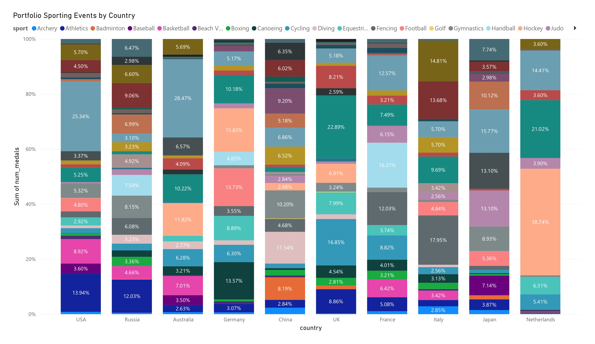

**Purpose:**
-  To analyze the **distribution of sporting events** among the top 10 countries, particularly focusing on whether any country dominates multiple events in the Olympics.

**Summary:**
- All of **the top 10 countries** exhibit dominance in certain sporting events, as reflected in their medal compositions.
- With the exception of Russia, each country demonstrates strong dominance in multiple events, securing **over 10% of their total medals** in at least **two distinct sports**.

## 9. New Metrics
### Key Sports for Improving Overall Medal Performance

#### 1. Defining Age and BMI Thresholds for Categorization
```sql
SELECT
	'Age' AS metrics,
	PERCENTILE_CONT(0.25) WITHIN GROUP (ORDER BY age) AS q1,
	PERCENTILE_CONT(0.5) WITHIN GROUP (ORDER BY age) AS q2,
	PERCENTILE_CONT(0.75) WITHIN GROUP (ORDER BY age) AS q3
FROM dataset
UNION ALL
SELECT
	'BMI' AS metrics,
	PERCENTILE_CONT(0.25) WITHIN GROUP (ORDER BY ROUND(weight/(height/100)^2,2)) AS q1,
	PERCENTILE_CONT(0.5) WITHIN GROUP (ORDER BY ROUND(weight/(height/100)^2,2)) AS q2,
	PERCENTILE_CONT(0.75) WITHIN GROUP (ORDER BY ROUND(weight/(height/100)^2,2)) AS q3
FROM dataset
;
```
| Metrics | Q1    | Q2    | Q3    |
|---------|-------|-------|-------|
| BMI     | 21.08 | 22.74 | 24.65 |
| Age     | 23.0  | 26.0  | 29.0  |

**Purpose:**
- To classify athletes based on **age** and **BMI** in order to better understand the distribution of these factors across various sports.
- To identify potential performance patterns and provide data-driven insights into how **age and BMI** influence medal outcomes in different sports.
- To categorize sports based on these metrics for simplifying analysis and highlighting areas where countries can focus on improving athlete performance in future Olympic Games.

**Summary:**

- **BMI**
	- **Q1 (21.08)**: **25% of athletes** have a BMI lower than 21.08, indicating that a subset of athletes tend to have a lower BMI.
	- **Q2 (22.74)**: The **median BMI (Q2)** is 22.74, representing the **middle point** of the dataset where **50% of athletes** have a BMI lower and **50% have a BMI higher**.
	- **Q3 (24.65)**: **75% of athletes** have a BMI lower than 24.65, signifying that most athletes have a BMI in the "normal" or "low" range, with fewer falling into the "overweight" category.

- **Age**
	- **Q1 (23.0)**: **25% of athletes** are younger than 23 years old, showing that a notable portion of athletes are in the **younger age group**.
	- **Q2 (26.0)**: The **median age** is **26**, suggesting that the majority of athletes are in their **mid-20s**.
	- **Q3 (29.0)**: **75% of athletes** are younger than 29 years old, indicating that most athletes are in the **younger to mid-age category**, with fewer athletes in the older age range.

#### 2. Age and BMI Categories for Olympic Sports and Medal Distribution
```sql
CREATE VIEW sport_age_bmi_category AS
SELECT
	sport,
	CONCAT(age_category,'-',bmi_category) AS age_bmi_cat,
	avg_age,
	CONCAT(CAST(q1_age AS TEXT),'-',CAST(q3_age AS TEXT)) AS range_age,
	avg_bmi,
	CONCAT(CAST(q1_bmi AS TEXT),'-',CAST(q3_bmi AS TEXT)) AS range_bmi,
	num_medals
FROM (
	SELECT
		sport,
		COUNT(*) AS num_medals,
		ROUND(AVG(age),2) AS avg_age,
		PERCENTILE_CONT(0.25) WITHIN GROUP(ORDER BY age) AS q1_age,
		PERCENTILE_CONT(0.75) WITHIN GROUP(ORDER BY age) AS q3_age,
		ROUND(AVG(weight/(height/100)^2),2) AS avg_bmi,
		ROUND(CAST(PERCENTILE_CONT(0.25) WITHIN GROUP (ORDER BY weight/(height/100)^2) AS NUMERIC),2) AS q1_bmi,
		ROUND(CAST(PERCENTILE_CONT(0.75) WITHIN GROUP (ORDER BY weight/(height/100)^2) AS NUMERIC),2) AS q3_bmi,
		CASE
			WHEN ROUND(AVG(age),2) <=23 THEN 'Youth'
			WHEN ROUND(AVG(age),2) BETWEEN 24 AND 28 THEN 'Mid-Age'
			ELSE 'Senior'
		END AS age_category,
		CASE
			WHEN ROUND(AVG(weight/(height/100)^2),2)<=21.08 THEN 'Low'
			WHEN ROUND(AVG(weight/(height/100)^2),2) BETWEEN 21.09 AND 24.64 THEN 'Normal'
			ELSE 'Heavy'
		END AS bmi_category
	FROM dataset
	GROUP BY
		sport
	ORDER BY
		COUNT(*) DESC 
)
ORDER BY num_medals DESC
;
```
| **Sport**              | **Age Category** | **Average Age** | **Age Range**    | **Average BMI** | **BMI Range**        | **Num Medals** |
|------------------------|------------------|-----------------|-----------------|------------------|----------------------|----------------|
| Swimming               | Youth-Normal     | 22.88           | 20-25           | 22.31            | 20.98-23.77          | 956            |
| Athletics              | Mid-Age-Normal   | 26.04           | 23-29           | 22.30            | 20.03-23.67          | 939            |
| Rowing                 | Mid-Age-Normal   | 27.85           | 25-30           | 23.43            | 22.00-24.97          | 720            |
| Football               | Mid-Age-Normal   | 24.11           | 21-27           | 22.51            | 21.34-23.71          | 513            |
| Hockey                 | Mid-Age-Normal   | 26.28           | 24-28           | 22.81            | 21.56-24.09          | 485            |
| Handball               | Senior-Normal    | 28.13           | 25-31           | 24.02            | 22.20-25.51          | 440            |
| Canoeing               | Mid-Age-Normal   | 26.87           | 23-30           | 24.14            | 22.79-25.47          | 415            |
| Cycling                | Mid-Age-Normal   | 27.18           | 24-31           | 23.12            | 21.28-24.91          | 389            |
| Water Polo            | Mid-Age-Normal   | 26.38           | 23-29           | 24.57            | 22.52-26.35          | 384            |
| Basketball            | Mid-Age-Normal   | 27.13           | 24-30           | 23.45            | 21.87-24.90          | 359            |
| Volleyball            | Mid-Age-Normal   | 27.31           | 24-30           | 22.28            | 21.05-23.55          | 353            |
| Gymnastics            | Youth-Low        | 21.21           | 18-24           | 20.68            | 18.61-22.48          | 348            |
| Fencing               | Mid-Age-Normal   | 27.00           | 24-30           | 22.29            | 20.86-23.56          | 320            |
| Wrestling             | Mid-Age-Heavy    | 25.81           | 23-28           | 25.19            | 22.31-27.29          | 317            |
| Judo                  | Mid-Age-Heavy    | 25.68           | 23-28           | 25.70            | 22.06-27.70          | 280            |
| Sailing               | Senior-Normal    | 29.64           | 26-32           | 23.18            | 21.06-24.24          | 255            |
| Boxing                | Mid-Age-Normal   | 24.31           | 22-26           | 21.96            | 19.72-23.67          | 239            |
| Shooting              | Senior-Normal    | 30.80           | 25-35           | 24.57            | 21.93-26.73          | 237            |
| Equestrianism         | Senior-Normal    | 37.98           | 31-44           | 21.90            | 20.31-23.15          | 227            |
| Weightlifting         | Mid-Age-Heavy    | 24.18           | 22-26           | 27.84            | 23.98-29.15          | 225            |
| Baseball              | Mid-Age-Heavy    | 27.04           | 23-30           | 26.03            | 24.54-27.47          | 216            |
| Diving                | Youth-Low        | 22.76           | 20-26           | 20.94            | 19.52-22.49          | 180            |
| Synchronized Swimming | Mid-Age-Low      | 24.01           | 22-26           | 19.75            | 19.03-20.31          | 160            |
| Taekwondo             | Senior-Normal    | 23.45           | 21-26           | 21.37            | 19.27-23.25          | 144            |
| Softball              | Mid-Age-Normal   | 27.03           | 24-29.75        | 23.99            | 22.32-25.11          | 134            |
| Archery               | Mid-Age-Normal   | 25.12           | 21-27.25        | 23.87            | 21.57-25.45          | 120            |
| Badminton             | Mid-Age-Normal   | 25.72           | 23-28           | 22.21            | 21.22-23.21          | 120            |
| Table Tennis          | Mid-Age-Normal   | 25.68           | 23-28           | 21.71            | 20.70-22.56          | 108            |
| Rhythmic Gymnastics   | Youth-Low        | 19.34           | 17-21           | 17.21            | 16.33-18.08          | 102            |
| Tennis                | Mid-Age-Normal   | 27.22           | 24-30           | 22.30            | 21.26-23.42          | 102            |
| Rugby Sevens          | Mid-Age-Heavy    | 25.34           | 23-28           | 25.87            | 24.26-27.75          | 74             |
| Beach Volleyball      | Senior-Normal    | 29.75           | 27-33.25        | 22.68            | 21.34-24.26          | 60             |
| Triathlon             | Senior-Low       | 28.20           | 26-30.75        | 20.32            | 19.29-21.22          | 30             |
| Modern Pentathlon     | Mid-Age-Normal   | 27.07           | 25-28           | 21.09            | 19.83-22.32          | 30             |
| Trampolining          | Mid-Age-Normal   | 24.03           | 21.5-26         | 21.26            | 20.07-21.88          | 30             |
| Golf                  | Senior-Heavy     | 31.17           | 26.5-37.5       | 24.97            | 23.07-25.60          | 6              |

**Purpose:**

The purpose of this dataset is to categorize Olympic sports based on **age** and **BMI** ranges to help analyze how these factors influence the overall medal distribution. By examining these metrics, we aim to provide insights that could inform strategic recommendations for countries to improve their performance in future Olympic events. For each sport, the following metrics are provided:
- **Age Category:** Divided into groups like **Youth**, **Mid-Age**, and **Senior**.
- **BMI Category:** Classified into **Low**, **Normal**, and **Heavy** BMI ranges.
- **Average Age:** The **mean age** of athletes in each sport.
- **Range of Age:** The **interquartile range (Q1-Q3)** representing the middle 50% of athletes' ages.
- **Average BMI:** The **mean BMI** of athletes in each sport.
- **Range of BMI:** The **interquartile range (Q1-Q3)** for athletes' BMI in each sport.
- **Number of Medals:** The **total number of medals** won by athletes in each sport.

**Summary:**
- **Youth Sports (e.g., Swimming, Gymnastics)** typically have a **lower average age** and **BMI**. These sports tend to attract younger athletes with lighter body mass.
- **Mid-Age Sports (e.g., Athletics, Football, Rowing)** have athletes within a **moderate age** and **BMI range**. These sports may have a more balanced performance profile in terms of age and physical condition.
- **Senior Sports (e.g., Equestrianism, Golf, Shooting)** tend to have **older athletes** with varying BMI ranges. Senior athletes in these sports may benefit from experience over physical fitness.
- **BMI Variability:** The **range of BMI** varies significantly across sports, indicating different **physical demands** per sport.
- **Medal Distribution:** The **number of medals** varies across sports, with a higher concentration of medals in **mid-age** and **normal BMI** categories. This suggests that athletes within these categories are more likely to achieve success in Olympic events.

### 3. Medal Distribution by Age and BMI Categories
```sql
SELECT
	age_bmi_cat,
	ROUND(AVG(num_medals)) AS avg_medals,
	ROUND(SUM(num_medals)) AS sum_medals,
	COUNT(sport) AS num_sports
FROM sport_age_bmi_category
GROUP BY age_bmi_cat
ORDER BY avg_medals DESC
;
```
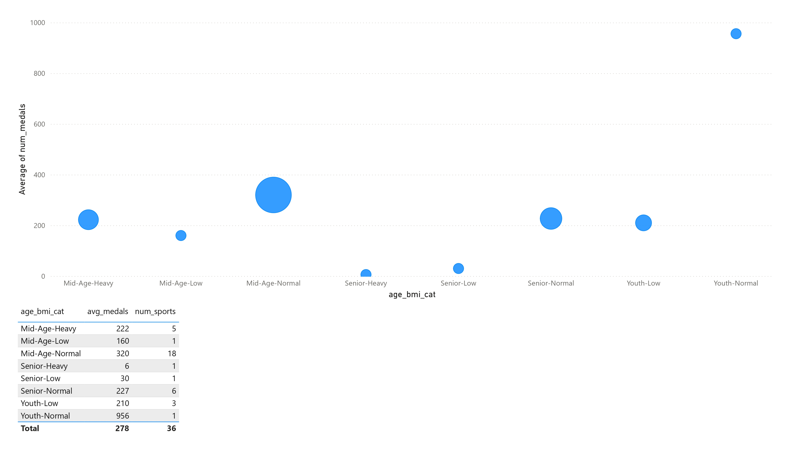
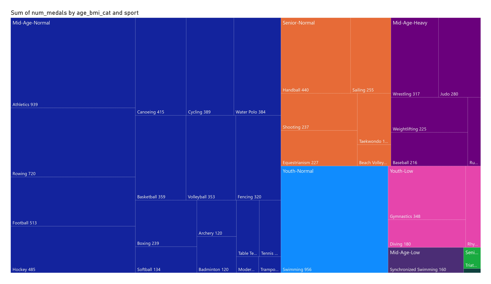


**Purpose:**

This dataset aims to analyze the distribution of Olympic medals across different **age** and **BMI** categories. It provides a summary of **average medals** and **total medals** won by athletes based on their classification into specific **age** and **BMI** categories. This categorization helps in understanding which age and BMI groups are more likely to achieve success in the Olympics. The data presents the following key columns:
- **age_bmi_cat:** The combined classification of **age** and **BMI** categories.
- **avg_medals:** The **average number of medals** won by athletes in each **age_bmi_cat**.
- **sum_medals:** The **total number of medals** won by athletes in each **age_bmi_cat**.
- **num_sports:** The number of sports represented by each **age_bmi_cat**.

**Summary**

- **Youth-Normal**: Athletes in this group have won an **average of 956 medals**, all from **1 sport** (e.g., Swimming).
- **Mid-Age-Normal**: This group shows the highest number of total medals (**5,760 medals**) spread across **18 sports**, with an **average of 320 medals**.
- **Senior-Normal**: Athletes in this group have won a total of **1,363 medals**, averaging **227 medals** across **6 sports**.
- **Mid-Age-Heavy**: Athletes in this group have earned **1,112 medals** across **5 sports**, with an average of **222 medals**.
- **Youth-Low**: This category shows **630 total medals**, with an average of **210 medals**, earned from **3 sports**.
- **Mid-Age-Low**: This category is represented by **1 sport**, with a total of **160 medals** and an average of **160 medals**.
- **Senior-Low**: This category has the fewest medals, with **30 total medals** from **1 sport**, and an average of **30 medals**.
- **Senior-Heavy**: Similarly, this group has **6 total medals** and an average of **6 medals** from **1 sport**.

**Recommendations:**
- Prioritize **Youth-Normal** sports like **Swimming** since they yield high medal returns.
- **Mid-Age-Normal** is the safest bet for **long-term investment** since it includes many sports.
- Countries with **strong physical programs** might focus on **Mid-Age-Heavy** since it has a decent medal count.
- **Senior categories** contribute fewer medals, so they might not be as crucial for ranking improvement unless a country already has strengths in those sports.

